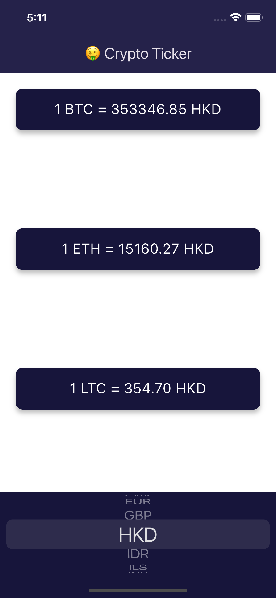
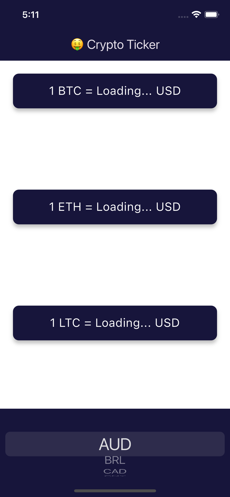

# Crypto Ticker 📈

Crypto Ticker is a simple and intuitive Flutter application that provides real-time cryptocurrency prices. The app utilizes the CoinAPI to fetch current exchange rates and display them in an easy-to-read format.

## Features

- 📊 Real-time cryptocurrency prices.
- 💱 Currency selection from a list of 21 fiat currencies.
- 🚀 Seamless UI with CupertinoPicker for currency selection.
- 🕵️‍♂️ Error handling with retry mechanism for network requests.
- 🌑 Dark theme with a visually appealing design.

## Screenshots

<p float="left">
  
  
</p>

<p float="left">
  
  
</p>

### Prerequisites

- Flutter SDK
- CoinAPI key

### Installation

1. **Clone the repository:**
   ```bash
   git clone https://github.com/risal-ea/crypto-ticker.git
